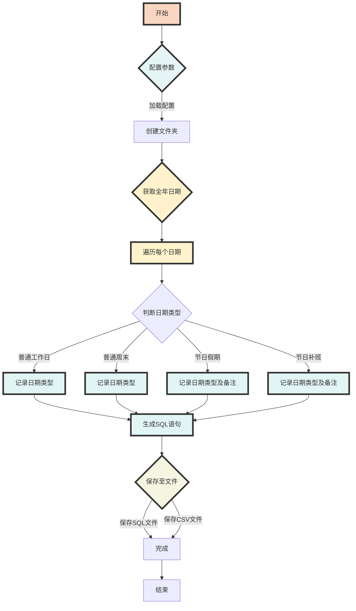

## 中国农历假期生成

使用场景： 根据中国的节假日表，自动生成Oracle工作日历插入报表。

操作：
- 因为需要同步最新的法定节假日库，所以需要移动`main.py`内部代码到公网环境。
- 更新`chinese_calendar`依赖库（使用`pip install -U chinesecalendar`命令进行更新。
- 填充`main.py`头部的参数地址并运行`main.py`即可生成Oracle的insert脚本。

## 示例运行
执行该脚本后，将在指定路径下生成 `.sql` 和 `.csv` 文件，分别包含 SQL 语句和数据统计表格。

## 配置
- `TARGET_TABLE`: 目标数据库表名。
- `TARGET_YEAR`: 生成数据的目标年份。
- `TARGET_SAVE_PATH`: 生成文件的保存路径。

## 执行流程
1. 创建必要的文件夹结构。
2. 获取目标年份的所有日期。
3. 对每个日期执行判断，并根据结果生成相应的 SQL 语句。
4. 将 SQL 语句写入文件，并将 DataFrame 数据输出为 CSV 文件。

Mermaid流程图：

## 注意
需要注意：由于次年的节假日安排，取决于国务院发布的日程。 一般是每年的`11月前后`发布新版本`chinesecalendar`。

如：2023年的数据，需要在2022年11月以后才可获取到。